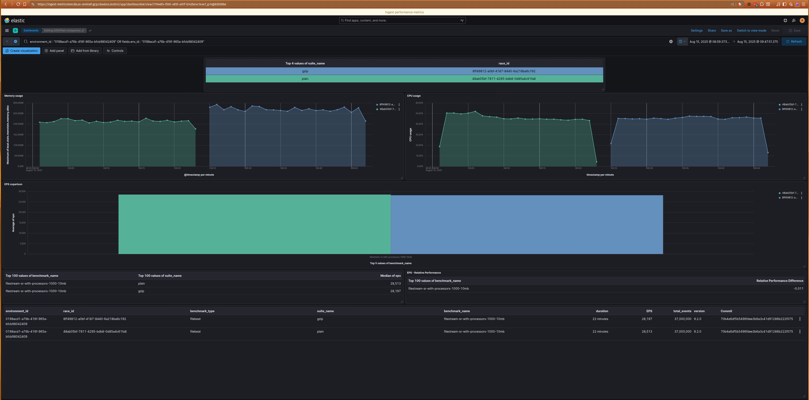
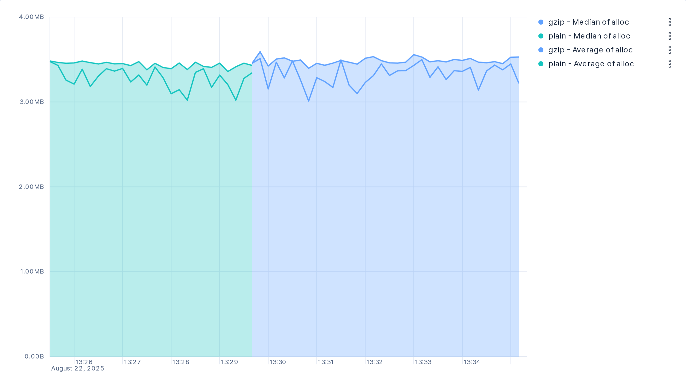
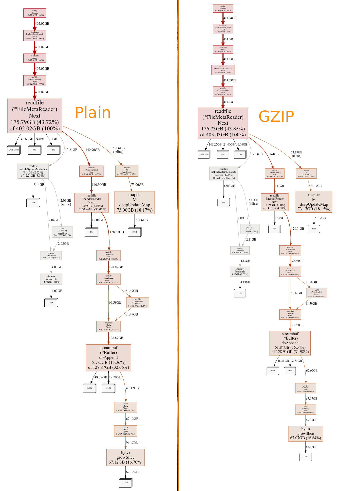
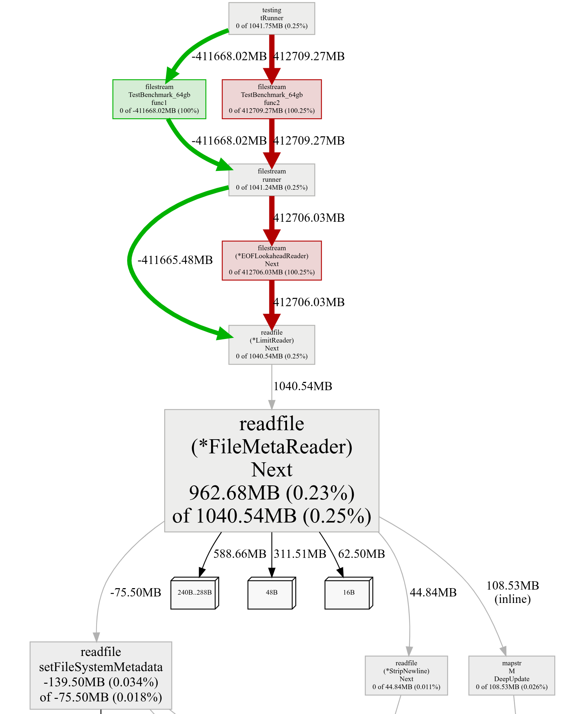

## Benchmark: 1,000 files of 10MB each

[Benchbuilder run](https://buildkite.com/elastic/filebeat-benchmark/builds/1453) | [Kibana dashboard](https://ingest-metricstore.kb.us-central1.gcp.cloud.es.io:9243/app/r/s/E993s)

#### Findings:
 - Identical EPS
 - Identical CPU usage
 - Constant increase in memory usage for GZIP files. 



## Benchmark 1 huge file ~64gb

A local benchmark was conducted to evaluate the file reading process in isolation.
This test instantiated the reader abstraction used by `filestream` (`filestream.open`), 
excluding overhead from other Filebeat components like processors and outputs.

```
go test -v -run TestBenchmark_64gb/plain -memprofile plain.mem.out -timeout=0
--- PASS: TestBenchmark_64gb (254.97s)
    --- PASS: TestBenchmark_64gb/plain (254.97s)

go test -v -run TestBenchmark_64gb/gzip -memprofile gzip.mem.out -timeout=0
--- PASS: TestBenchmark_64gb (334.15s)
    --- PASS: TestBenchmark_64gb/gzip (334.15s)
```

Initial tests showed a memory artifact, suggesting a leak, which was caused by 
collecting a CPU profile over the entire test duration. A second benchmark was 
therefore run without CPU profiling to gather accurate memory metrics.

```
go test -v -run TestBenchmark_64gb -timeout=0
=== RUN   TestBenchmark_64gb
=== RUN   TestBenchmark_64gb/plain
=== RUN   TestBenchmark_64gb/gzip
--- PASS: TestBenchmark_64gb (1130.28s)
    --- PASS: TestBenchmark_64gb/plain (251.57s)
    --- PASS: TestBenchmark_64gb/gzip (329.39s)
PASS
```

#### Findings:
 - Memory consumption is similar for both plain and GZIP files.
 - Memory usage remains low due to file streaming and on-the-fly decompression.
 - The GZIP reader does not continuously allocate new memory during operation.
 - GZIP files take longer to read, as expected.





## GZIP Reader vs. Writer and the Fleet Server Issue

According to the `klauspost/compress` [docs](https://github.com/klauspost/compress/?tab=readme-ov-file):

> Memory usage is typically 1MB for a Writer. stdlib is in the same range. If you expect to have a lot of concurrently allocated Writers consider using the stateless compress described below.

The Writer is to be significantly more memory-intensive than the Reader.
[The issue faced by Fleet Server](https://github.com/elastic/fleet-server/pull/2994)
was related to instantiating too many Writers at once. This is not the case for 
filestream, which only instantiates one Reader per file.

Additionally, the number of concurrent harvesters can be configured via 
`harvester_limit`. The results show that the additional memory per file is on 
the order of 100KB. Compared to the overall memory usage per file of ~4.5MB, 
this increase is negligible.
